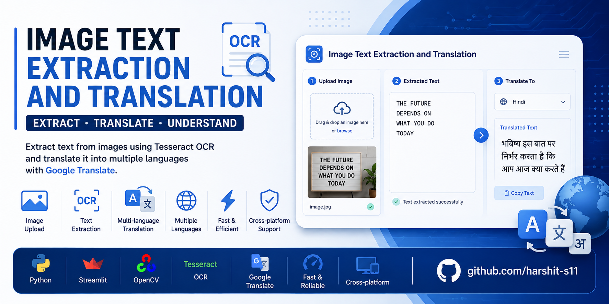

<p align="center">
  
</p>

# 📄 Image Text Extraction and Translation

<p align="center">


</p>

A Streamlit-based Optical Character Recognition (OCR) application that extracts text from images using **Tesseract OCR** and translates it into multiple languages using **Google Translate**.

The project demonstrates an end-to-end OCR workflow including image upload, text extraction, multilingual translation, and an interactive web interface for seamless user interaction.

---

# 📖 Project Overview

Extracting text from images and translating it into different languages has numerous real-world applications, including document digitization, accessibility, multilingual communication, and educational tools.

This project combines **Computer Vision**, **Optical Character Recognition (OCR)**, and **Language Translation** to create an easy-to-use web application where users can upload an image, extract textual content, and instantly translate it into their preferred language.

---

# ✨ Features

- Upload JPG, JPEG, and PNG images
- Optical Character Recognition (OCR) using Tesseract
- Automatic text extraction
- Multi-language translation
- Interactive Streamlit web interface
- Fast image processing
- Copy translated text
- Cross-platform support

---

# 🛠 Tech Stack

- Python
- Streamlit
- OpenCV
- Tesseract OCR
- Google Translate (googletrans)

---

# 🔄 Application Workflow

```text
Upload Image
      │
      ▼
Image Preprocessing
      │
      ▼
Tesseract OCR
      │
      ▼
Extract Text
      │
      ▼
Google Translate
      │
      ▼
Translated Output
```

---

# 📂 Project Structure

```text
Image-Text-Extraction-and-Translation/
│
├── app.py
├── banner.png
├── README.md
├── requirements.txt
├── LICENSE
└── .gitignore
```

---

# 🚀 Getting Started

## Clone the Repository

```bash
git clone https://github.com/harshit-s11/Image-Text-Extraction-and-Translation.git
```

---

## Navigate to the Project Directory

```bash
cd Image-Text-Extraction-and-Translation
```

---

## Install Dependencies

```bash
pip install -r requirements.txt
```

---

## Install Tesseract OCR

### Windows

1. Download and install **Tesseract OCR**.
2. Add the installation directory to your system **PATH**.

Example:

```text
C:\Program Files\Tesseract-OCR\
```

If Tesseract is not added to PATH, update the executable path inside `app.py`.

### Linux

```bash
sudo apt install tesseract-ocr
```

### macOS

```bash
brew install tesseract
```

---

# ▶️ Run the Application

```bash
streamlit run app.py
```

The application will launch in your default web browser.

---

# 🌍 Supported Languages

The application currently supports translation into multiple languages including:

- English
- Hindi
- Tamil
- Telugu
- Malayalam

Additional languages supported by Google Translate can be integrated with minimal changes.

---

# 💼 Applications

- Document Digitization
- Educational Tools
- Language Translation
- Accessibility Solutions
- Smart Document Processing
- Digital Archiving
- OCR-based Automation

---

# 🎯 Learning Outcomes

Through this project, I gained practical experience with:

- Optical Character Recognition (OCR)
- Computer Vision
- Image Processing
- Tesseract OCR
- Google Translate Integration
- Streamlit Web Applications
- Python-based GUI Development
- End-to-End AI Application Development

---

# 🔮 Future Improvements

- PDF Document OCR
- Real-time Camera OCR
- Additional Language Support
- OCR Confidence Score Visualization
- Export Results as PDF or Word
- Docker Containerization
- Cloud Deployment

---

# 📜 License

This project is licensed under the **MIT License**.

---

# 👨‍💻 Author

**Harshit Sharma**

Final-year B.Tech Computer Science Engineering Student

VIT Chennai

🔗 GitHub: https://github.com/harshit-s11

🔗 LinkedIn: https://linkedin.com/in/harshit-sharma24

---

⭐ If you found this repository useful, consider giving it a star.
